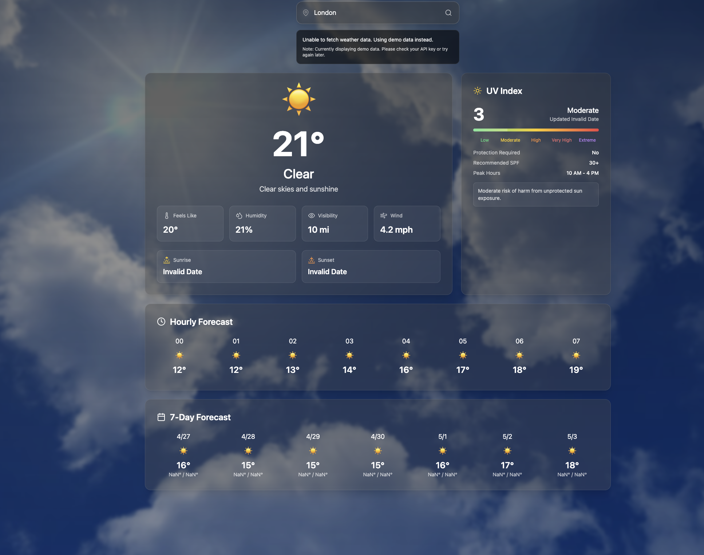

# Weather Forecasting App 🌤️

A modern, responsive weather application built with React, TypeScript, and Tailwind CSS. This app provides real-time weather information with a beautiful and intuitive user interface.



## Features ✨

- **Real-time Weather Data**: Get current weather conditions for any city worldwide
- **Detailed Forecast**: View hourly and 7-day weather forecasts
- **UV Index Information**: Comprehensive UV index data with safety recommendations
- **Beautiful UI**: Modern, responsive design with smooth animations
- **Interactive Elements**: Hover effects, transitions, and dynamic updates
- **Weather Icons**: Visual representation of weather conditions
- **Sunrise/Sunset Times**: Track daylight hours
- **Multiple Metrics**: Temperature, humidity, wind speed, visibility, and more

## Technologies Used 🛠️

- React
- TypeScript
- Tailwind CSS
- Vite
- OpenWeatherMap API
- Lucide Icons

## Getting Started 🚀

1. Clone the repository:
   ```bash
   git clone https://github.com/RahulMishra09/weather-forecasting.git
   ```

2. Install dependencies:
   ```bash
   cd weather-forecasting
   npm install
   ```

3. Create a `.env` file in the root directory and add your OpenWeatherMap API key:
   ```
   VITE_OPENWEATHER_API_KEY=your_api_key_here
   ```

4. Start the development server:
   ```bash
   npm run dev
   ```

5. Open your browser and navigate to `http://localhost:5173`

## Features in Detail 📊

### Current Weather
- Real-time temperature
- Weather conditions and description
- Feels like temperature
- Humidity percentage
- Wind speed
- Visibility range

### UV Index Card
- Current UV index value
- Risk level indicator
- Protection recommendations
- Peak hours information
- Safety guidelines

### Hourly Forecast
- 8-hour weather forecast
- Temperature trends
- Weather condition icons
- Time-based updates

### 7-Day Forecast
- Daily temperature highs and lows
- Weather condition icons
- Day-by-day overview
- Temperature range display

## Styling and Animations 🎨

- Glass morphism effects
- Smooth transitions and hover states
- Responsive design for all screen sizes
- Dynamic background changes based on weather
- Animated weather icons
- Custom scrollbars
- Loading animations

## Contributing 🤝

Contributions are welcome! Please feel free to submit a Pull Request.

## License 📄

This project is licensed under the MIT License - see the [LICENSE](LICENSE) file for details.

## Acknowledgments 🙏

- OpenWeatherMap for providing the weather data API
- Lucide for the beautiful icons
- Tailwind CSS for the amazing utility-first CSS framework